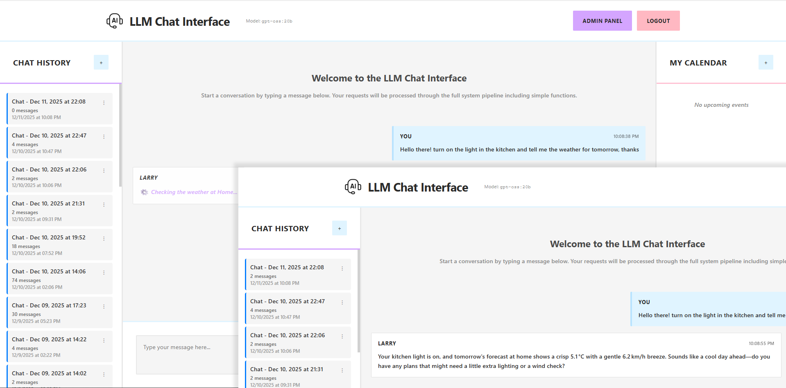
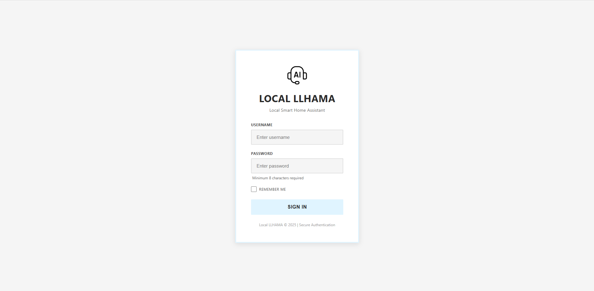

# Local_LLAMA: Offline, Multilingual Smart Home Voice and Chat Assistant


**Local_LLAMA** is a local-first, multilingual, LLM-powered voice and chat assistant that integrates seamlessly with [Home Assistant](https://www.home-assistant.io/) and custom function calling. 
Designed for privacy, flexibility, and natural interaction, it allows users to control smart home devices using natural language — all without relying on the cloud or requiring exact device names. 
As an independent system that runs on base Linux and interfaces with HA (or potentially other domotics systems) via API, it bypasses many compatibility restrictions that running similar systems in HA have (e.g., smart-speaker compatibility).

## Project Evolution: From Voice-Only to Complete Platform

The project started as a voice-first domotic assistant has evolved into a **complete self-hosted AI assistant platform** that aims to deliver an all-in-one package.
The trajectory change was caused by recent cloud-based AI services with ads and telemetry to which this project tries to offer an alternative.



**Current State**:

A dual-pipeline system with chat and voice as equally useful interfaces. Both share identical LLM capabilities—function calling, Home Assistant control, web search, calendar management, etc.
The system now includes comprehensive configuration management as well as presets, making it adaptable to different hardware configurations from single low-end GPUs to multi-GPU setups.

**What This Provides**:
- Control your home via voice OR chat
- Complete privacy with zero cloud dependency
- Contextual responses based on conversation history, with each user having their own private history.
- Ability to provide multiple commands in a single sentence 
- Configurable presets optimized for your hardware
- Full control over the system, its prompts and integration.

## Features

**Voice & Chat Pipelines** 
- Wake word detection using `OpenWakeWord` (voice activated pipeline only)
- Voice recording with adaptive noise floor detection (voice activated pipeline only)
- Whisper-based speech-to-text conversion (voice activated pipeline only)
- Real-time chat interface with message history (chat pipeline only, voice pipeline only keeps the last command in memory)

**Smart Home Control**
- Fuzzy device/entity matching using dynamic Home Assistant entity list
	- Say "light above the desk" instead of the exact device name
- Execute multiple commands in a single sentence
	- You can turn off a light, turn on the AC and ask about the news in a single command
- Integrate non-Home Assistant devices and custom functions
	- Function calling is integrated into the system and requires writing your function and adding it to those exposed to the LLM
- Natural language responses based on context, commands included

**Multilingual Support** (English, French, Spanish, Italian, German, Russian, and potentially more)
- Automatically detects and responds in the language you speak
- Say "la lumière du salon" for "living room light" even if the device is called "Luz del divan"

**Calendar & Reminders**
- Set reminders, alarms, and appointments with natural language
- Per-user calendar with automatic notifications, both voical and in chat
- Unified interface for all event types; each users sees only their calendar, the admin can only see voice-created events.

**Web & Information via Free/Open APIs**
- Real-time news via GDELT API
- Weather queries via Open-Meteo API
- Wikipedia API integration 
- You can replace/add/change these with whatever you want

**Web Interface**
- Real-time chat with Markdown support (bold, italic, code blocks)
- Indication of current task and response streaming
- Calendar sidebar with event management
- Customizable model name for chat usage
- Admin panel with user, language, prompt, system, web settings and more.
- Role-based access control (admin, chat permission)


## Latest Additions

- **Dual-Pipeline Architecture** - Voice and chat both share LLM capabilities, optimized for their respective UX patterns
- **Real-time Chat Interface** - Multi-user WebSocket communication with persistent message history
- **Per-User Context** - Conversation history tracking (last 3 exchanges) for contextual, aware responses
- **Unified Calendar System** - Single consolidated API for reminders, appointments, and alarms (reduced from 9 separate functions)
- **Admin Panel** - User management, permissions assignment, password reset
- **Markdown Chat Rendering** - Bold, italic, code blocks with syntax highlighting
- **Role-Based Access Control** - Granular permissions (admin, dashboard access, chat access)
- **Reponse Streaming and Optimized Context** - Contect passing has been optimized to maintain proper command/context handlign while keeping a reasonable lenght conversational context.


## System Requirements

- **CPU**: 4–8 cores (tested with Xeon E5-2640 v4)
- **RAM**: 8 GB for core system
- **GPU**: 8-24GB VRAM depending on preset (tested with RTX 4060Ti 16GB)
- **OS**: Linux (tested on Ubuntu 24.04, should work on 22.04)
- **Ollama Server**: Local or remote (required for LLM inference)

**Preset-Based Hardware Requirements:**

To simplify usage, configurations have been created an tested onvarious configurations; select the preset match your hardware:

- **english_only_small** (8GB VRAM): Qwen3:8B, English-only, minimal footprint for basic domotic control
- **english_only_large** (16GB VRAM): GPT-OSS:20B, English-only, high-quality general purpose
- **multi_lingual_small** (16GB VRAM): Qwen3:14B, 6 languages, balanced single-GPU multilingual
- **multi_lingual_large** (2x24GB VRAM): GPT-OSS:20B, 6 languages, maximum performance

**Performance Notes:**
- Core system uses ~3-4GB RAM
- LLM processing handled by Ollama server (can be local or remote), latency from a couple of seconds to 20-30 based on context/prompt lenght
- Multi-machine setup tested: Ollama on separate server via ethernet (~3 second latency for voice commands)
- System tested in Ubuntu VM (Proxmox) with remote Ollama server and bare metal on a laptop.
- Apply presets via web UI or CLI to optimize for your configuration

## Installation

1. **Clone the repository**

2. **Install dependencies:**

```bash
pip install -r requirements.txt
```

Requires Python 3.10+ (3.12 recommended).

3. **Setup Ollama Server:**

Install and configure Ollama on a local or remote machine:
```bash
# Install Ollama (see https://ollama.ai for instructions)
curl -fsSL https://ollama.com/install.sh | sh

# Pull your preferred model
ollama pull llama2  # or any other model
```

4. **Configure environment variables:**

```bash
cp .env.example .env
```

Edit `.env` with your credentials:
- `HA_BASE_URL`: Home Assistant URL (e.g., `http://homeassistant.local:8123`)
- `HA_TOKEN`: Long-Lived Access Token from HA Profile settings
- `OLLAMA_IP`: Ollama server IP:port (e.g., `192.168.1.100:11434` or `localhost:11434`)
- `ALLOWED_IP_PREFIXES`: Comma-separated IP prefixes for web UI access

**Important:** Never commit `.env` to version control.



## Configuration

### Configuration Presets

Local_LLAMA uses a preset system to provide optimized configurations for different hardware setups. 
Presets are complete configuration packages that set LLM models, Whisper models, TTS languages, and performance parameters.

**Available Presets:**

- **english_only_small** - Lightweight English-only setup for memory-constrained environments (8GB VRAM, Qwen3:8B)
- **english_only_large** - High-quality English with large model for better performance (16GB VRAM, GPT-OSS:20B)
- **multi_lingual_small** - Balanced multilingual for single GPU systems (16GB VRAM, Qwen3:14B, 6 languages)
- **multi_lingual_large** - High-performance multilingual for multi-GPU setups (1x24GB VRAM or 16+6 GB VRAM with 2 GPUs, GPT-OSS:20B, 6 languages)

Each preset configures:
- LLM model selection and parameters
- Whisper model size (small/medium/turbo, etc)
- Text-to-speech language models to use based on language
- ChatHandler settings (max_tokens, context window sizes, reduction factors, etc)

**Applying Presets:**

Via CLI:
```bash
python preset_manager.py apply <preset_id>
```

Via Web UI:
1. Navigate to Admin Panel → Presets tab
2. Review preset details and requirements
3. Click "Apply This Preset"
4. Restart system for changes to take effect

Custom presets can be created through the web UI or by adding JSON files to `local_llhama/settings/presets/`.

### Environment Variables (.env)

Security-sensitive configuration stored in `.env` (never commit):
- `HA_BASE_URL`: Home Assistant base URL
- `HA_TOKEN`: Long-Lived Access Token
- `OLLAMA_IP`: Ollama server IP:port (if using Ollama)
- `ALLOWED_IP_PREFIXES`: IP prefixes for web UI access

See `.env.example` for template.

### object_settings.json

Non-sensitive configuration stored in JSON with class/variable structure:

```json
"HomeAssistantClient": {
  "allowed_entities": {
    "value": ["light.kitchen_light", "light.desk_light", ...],
    "type": "list"
  },
  "ALLOWED_DOMAINS": {
    "value": ["light", "climate", "switch", "fan", ...],
    "type": "list"
  }
}
```

Contains LLM model settings, ChatHandler configuration, TTS language mappings, and other non-sensitive configuration.
 Automatically updated when presets are applied. Modified via Settings_Loader.

**ChatHandler Configuration:**
- `max_tokens`: Maximum LLM response length (512-32768) - to keep things reasonably reactive and not overwhelm the context, reccommend staying at 6144 max for 20B, increase for bigger models.
- `default_context_words`: Initial conversation context window (50-2000) - to not overwhelm context, recommend staying around 800-1000 works max for 20B models; increase for bigger models.
- `min_context_words`: Minimum context before reduction (50-1000) 
- `context_reduction_factor`: Rate of context reduction when limits reached (0.1-0.9)

### web_search_config.json

Configures web information sources (news, Wikipedia, etc.) with allowed websites, max results, and timeout settings.
 
 
## How It Works

1. **Wake Word Detection**  
   Continuous listening via `OpenWakeWord` until "Hey Jarvis" detected. Sensitivity adjustable via `wakeword_thr` in settings.
   The wakeword can be chaged to something else.

2. **Speech Recording**  
   Records 3-10 seconds after wake word; stops early on silence detection using dynamic noise floor.

3. **Speech-to-Text**  
   Whisper transcribes audio (medium model for multilingual, small model for English-only).

4. **Command Parsing**  
   - **Voice Pipeline**: Processes through state machine sequentially
   - Transcribed text + HA entities sent to LLM via Ollama
   - Entities manually supplied or auto-fetched from HA
   - LLM identifies devices/actions, generates HA JSON or NL response
   - Different prompts for voice (RESPONSE_PROCESSOR_PROMPT) vs chat (CONVERSATION_PROCESSOR_PROMPT)
   - Per-user conversation history maintained in chat for contextual responses
   - Calendar operations parsed and executed via natural language (per-user in chat)
   - Web queries fetch real-time data (weather, news, Wikipedia)
   - **Chat Pipeline**: Parallel processing via ChatHandler, bypasses state machine for multi-user support

5. **Command Execution**  
   - Valid JSON sent to HA API
   - Calendar events stored in local SQLite database
   - Background thread monitors for due reminders/alarms and triggers notification sound + chat notifications
   - Non-HA actions matched via `command_schema.txt` using reflection
   - Failed queries reported to user

6. **Feedback and Output**  
   - The piper-tts engine provides spoken confirmation or failure (voice pipeline only)
   - Real-time WebSocket communication for chat interface with instant LLM responses
   - Output and logs available through comprehensive web UI with multiple views; enable dev mode to have full output.
   - Per-user calendar events displayed in chat sidebar with real-time updates
   - Calendar event notifications sent directly to user's chat when reminders/alarms trigger
   - Loading indicators show when LLM is processing ("Thinking...", "Searching Wikipedia..." animation)
   - The language is returned along with the response by the LLM
  
## Example Commands

```text
Turn off the kitchen lights and turn on the living room lamp.
Éteins la lumière du salon et allume la clim dans la chambre.
Apaga la luz de la cocina y enciende la lámpara del salón.
Turn on the desk light and tell me the weather.
What's in the news today?
Tell me about the Eiffel Tower.
Set a reminder to drink water in 30 minutes.
Add an appointment for tomorrow at 2 PM.
What reminders do I have today?
List my calendar for the next week.
```

## Dependencies

Key libraries used in this project include:

Lowest supported python version is 3.10, but 3.12 is recommended.

- `torch` (required by openai-whisper for audio processing)
- `openai-whisper` (speech-to-text)
- `openwakeword` (wake word detection)
- `piper-tts` (text-to-speech)
- `pygame` (audio playback)
- `pyaudio` (audio I/O)
- `flask`, `flask-socketio` (web UI and real-time communication)
- `psycopg2-binary`, `asyncpg` (PostgreSQL integration)
- `requests` (HTTP client for Ollama and web APIs)

**Note:** While `torch` is required for Whisper's audio processing, the system uses Ollama for all LLM inference, keeping GPU requirements minimal.

All dependencies are listed in `requirements.txt`.

## License

This project is licensed under the **Creative Commons Attribution 4.0 International (CC BY 4.0)** license.

You are free to:

- **Share** — copy and redistribute the material in any medium or format  
- **Adapt** — remix, transform, and build upon the material for any purpose, even commercially

Under the following terms:

- **Attribution** — You must give appropriate credit, provide a link to the license, and indicate if changes were made.

Read the full license here: [https://creativecommons.org/licenses/by/4.0/](https://creativecommons.org/licenses/by/4.0/)

## Acknowledgments

- OpenAI for Whisper [https://github.com/openai/whisper]
- Piper TTS by rhasspy [https://github.com/rhasspy/piper]
- OpenWakeWord by dscripka [https://github.com/dscripka/openWakeWord]
- Home Assistant open-source platform [https://www.home-assistant.io/]
- GDELT Project for real-time global event data [https://www.gdeltproject.org/]
- Developers of Pygame ([https://github.com/pygame/pygame]) and other community-driven tools

## Contributing

Contributions and suggestions welcome! See "Future Work" for ideas. Response time may vary due to limited availability.

Open discussions before submitting major PRs.

## Future Work

**Recently Completed:**
- Configuration preset system with hardware-optimized defaults
- ChatHandler configurable parameters (max_tokens, context windows)
- Admin panel preset management with create/apply workflow
- Modular admin panel architecture (templates and CSS)
- CLI preset management tool
- Multi-user chat with WebSocket communication
- Per-user conversation history and calendar
- Role-based access control
- Dual processing pipelines (voice + chat)
- Web search integration (GDELT news, Wikipedia)
- PostgreSQL transition and message embedding storage
- Markdown chat formatting

**Primary Goal:**
Create an **easy-to-install, easy-to-configure package** that serves as a complete cloud-free alternative to proprietary AI platforms. Focus on simplified deployment, hardware adaptability through presets, and intuitive configuration.

**Next Steps:**
- Package distribution (pip/apt installable)
- One-command installation with automatic dependency handling
- Interactive setup wizard for initial configuration
- Auto-detection of hardware capabilities with preset recommendations
- Improved documentation and quickstart guides
- Streamlined custom function integration
- Enhanced error handling and recovery
- Test coverage expansion


## Known Bugs
- Chat context can, under specific message switching circumstances, get mixed.

## Note

Developed as a versatile domotic assistant during spare time. Suggestions for improvements welcome. Hope you find it useful.

---

*Natural language control for smart homes — privately, locally*